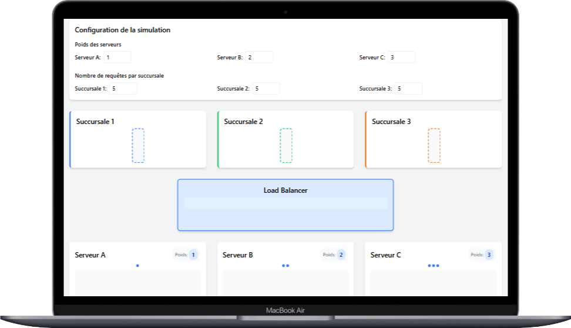
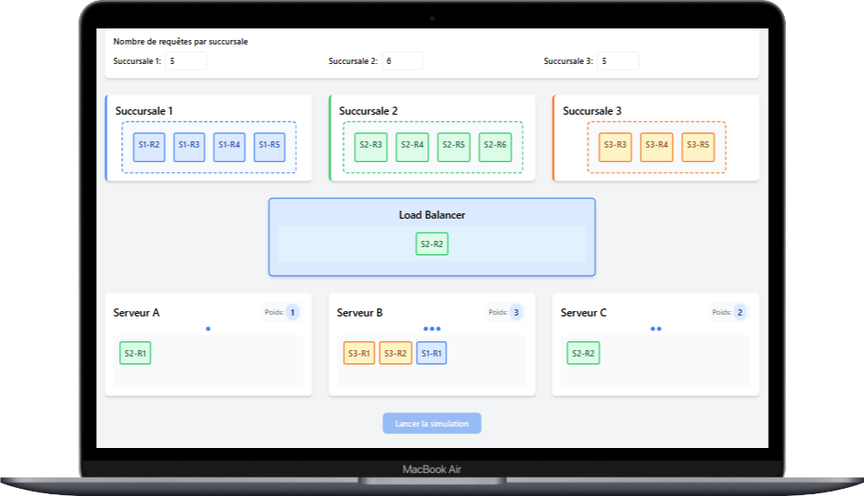
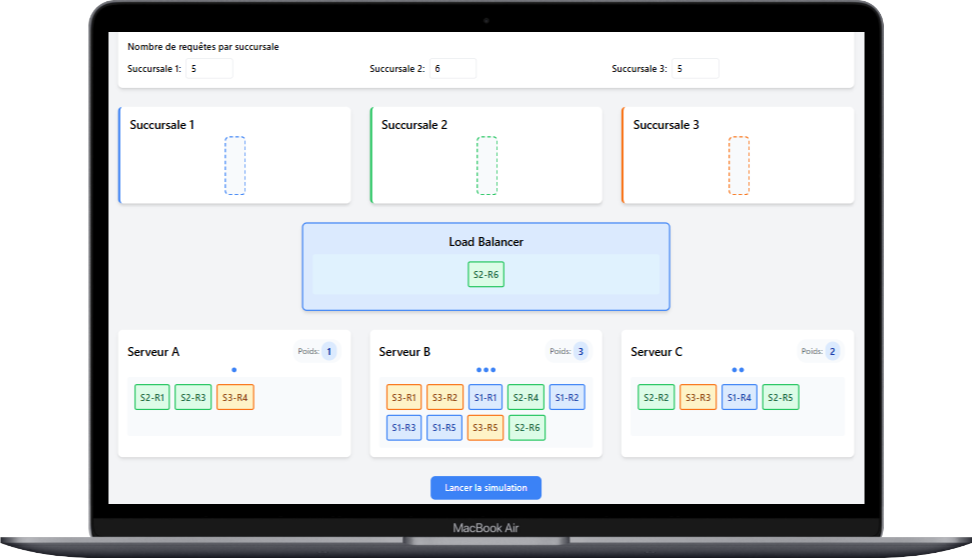
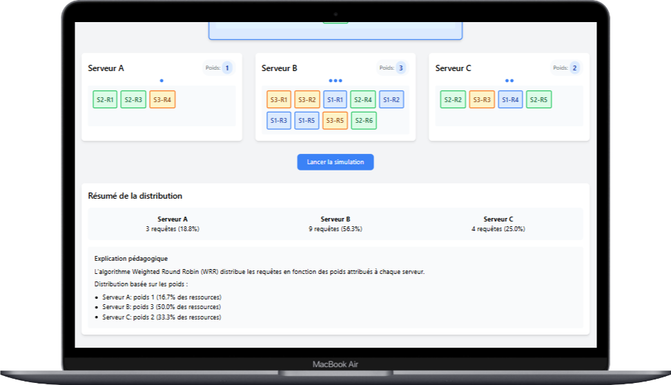

# 🚀 Simulation de Load Balancing avec Weighted Round Robin

## 📚 Contexte du Projet
Ce projet a été développé dans le cadre du cours de Réseaux Mobiles et Intelligents à l'École Nationale Supérieure Polytechnique de Yaoundé. Il s'agit d'une simulation interactive d'un système de load balancing utilisant l'algorithme Weighted Round Robin (WRR).

## 📝 Description
Cette application web simule un système de distribution de charge entre trois serveurs (A, B, C) recevant des requêtes de trois succursales différentes. L'algorithme Weighted Round Robin est utilisé pour distribuer les requêtes en fonction des poids attribués à chaque serveur.

### ✨ Fonctionnalités Principales
- 🎮 Interface interactive pour configurer les poids des serveurs
- 🔄 Simulation en temps réel de la distribution des requêtes
- 📊 Visualisation des requêtes par succursale
- 📈 Affichage de la distribution finale des requêtes
- 📖 Explication pédagogique du fonctionnement de l'algorithme

## 🏗️ Architecture Technique

### ⚙️ Backend
- 🐍 Framework : Flask (Python)
- 🔢 Algorithmes : Weighted Round Robin
- 📦 Structure de données : 
  - Classes Server et LoadBalancer
  - Files d'attente pour les requêtes
  - Dictionnaires pour la gestion des poids

### 🎨 Frontend
- 🌐 HTML5/CSS3 avec Tailwind CSS
- 📜 JavaScript pour l'interactivité
- 🎭 Animations CSS pour la visualisation

## 🛠️ Installation et Démarrage

### 📋 Prérequis
- 🐍 Python 3.8 ou supérieur
- 📦 pip (gestionnaire de paquets Python)

### 📥 Installation
1. Cloner le repository :
   ```bash
   git clone https://github.com/ThePerformer0/load-balancing-simulation.git
   cd load-balancing-simulation
   ```
2. Installer les dépendances :
   ```bash
   pip install -r requirements.txt
   ```
3. Lancer l'application :
   ```bash
   python app.py
   ```
4. Accéder à l'application via : `http://localhost:5000`

## 📁 Structure du Projet
```
├── app.py                 # Application Flask principale
├── requirements.txt       # Dépendances Python
├── static/
│   ├── css/
│   │   └── style.css     # Styles CSS
│   └── js/
│       └── simulation.js # Logique de simulation
│
└── templates/
    └── index.html        # Template principal
```

## 🎯 Utilisation
1. ⚖️ Configurer les poids des serveurs (1-10)
2. 📊 Définir le nombre de requêtes par succursale
3. ▶️ Lancer la simulation
4. 👀 Observer la distribution des requêtes en temps réel
5. 📊 Analyser les résultats finaux

## 📸 Captures d'Écran
1. L'interface principale avec la configuration

2. La simulation en cours

3. Les résultats finaux

4. L'explication pédagogique


## 📚 Concepts Pédagogiques
- 🔄 Load Balancing
- ⚖️ Algorithme Weighted Round Robin (WRR)
- 📊 Distribution de charge
- ⚡ Gestion des requêtes simultanées
- 📈 Visualisation de données en temps réel

## 👥 Auteurs
- Feke Jimmy Wilson

## 📄 Licence
[Préciser la licence]

## 🙏 Remerciements
- 👨‍🏫 Professeurs du cours de Réseaux Mobiles et Intelligents : Professeur Djotio, Mme Nouhou
- 🏫 École Nationale Supérieure Polytechnique de Yaoundé
